# 🏥 HealthBridge — Hospital Management & Patient Portal Platform

<div align="center">

[](https://www.php.net/)
[](https://www.mysql.com/)
[](https://developer.mozilla.org/en-US/docs/Web/JavaScript)
[](https://developer.mozilla.org/en-US/docs/Web/CSS)
[](LICENSE)
[]()

**A modern, enterprise-grade healthcare management platform featuring a Patient Portal, Clinical Doctor Workspace, and Administrative Analytics Engine.**

[Key Features](#-key-features) • [Visual Walkthrough](#-visual-walkthrough--feature-showcase) • [Architecture](#-system-architecture) • [Directory Structure](#-directory-structure) • [Installation Guide](#-installation--setup-guide) • [Demo Credentials](#-demo-accounts--quick-login) • [API Reference](#-api-endpoints-overview) • [License](#-license)

</div>

---

## 📖 Overview

**HealthBridge** is a comprehensive, responsive healthcare information system designed to bridge the gap between patients, medical practitioners, and hospital administrators. Built with modern Vanilla JavaScript (ES6+), modular CSS3 design tokens, and a secure PHP 8+ object-oriented backend with PDO, HealthBridge provides real-time appointment scheduling, clinical encounters, EMR management, multi-step rescheduling workflows, notifications, and granular audit trails.

---

## 📸 Visual Walkthrough & Feature Showcase

### 1. 🌐 Public Website & Modern Landing Page
The landing page provides patients with instant access to hospital services, top specialist profiles, emergency contact channels, and a 1-click booking entry point.

<div align="center">
  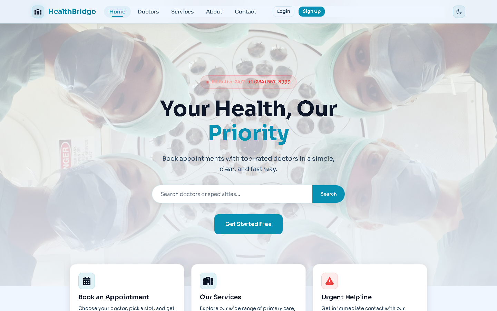
</div>

---

### 2. 🔐 Authentication & Quick-Login Switcher
Secure session-based authentication with instant one-click role switching for evaluation across **Patient**, **Doctor**, and **Administrator** profiles.

<div align="center">
  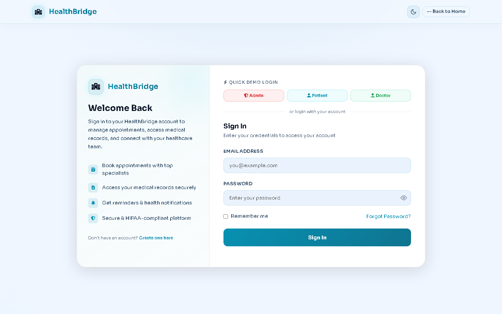
</div>

---

### 3. 👤 Patient Portal & Smart Booking Wizard
Patients can track their upcoming appointments, active prescriptions, recent vitals, and book appointments via a 4-step wizard with real-time doctor availability checks.

<div align="center">
  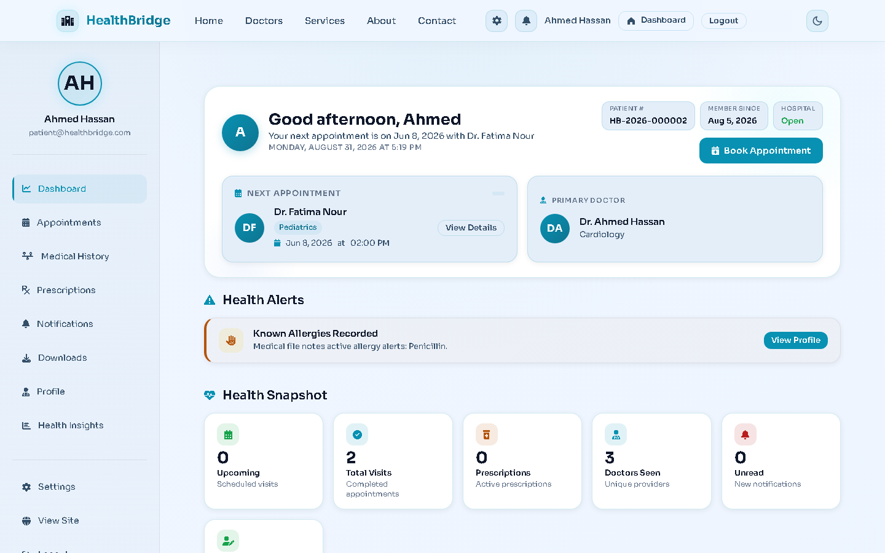
  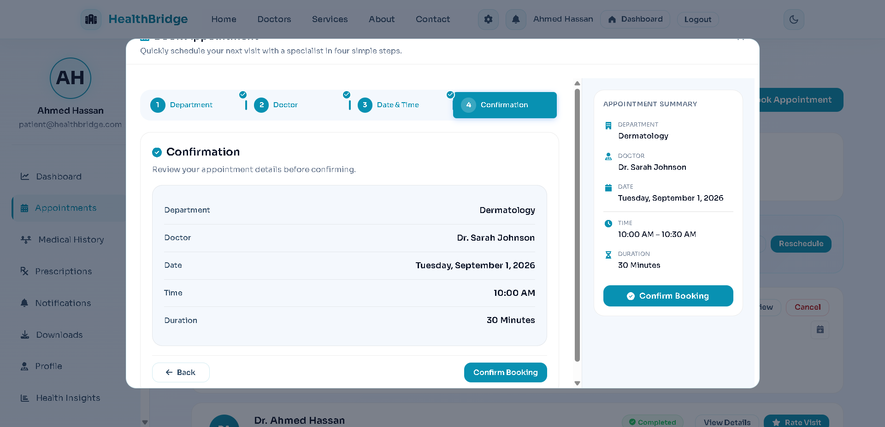
</div>

---

### 4. 📅 Appointment Rescheduling & Medical Records (EMR)
Patients can manage visits, request date/time reschedules with conflict detection, review detailed diagnosis history, and download printable prescription summaries.

<div align="center">
  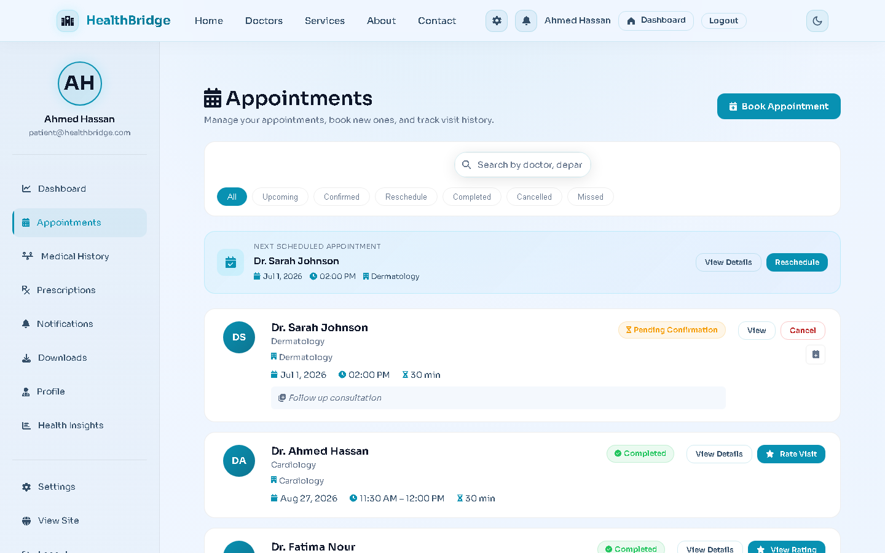
  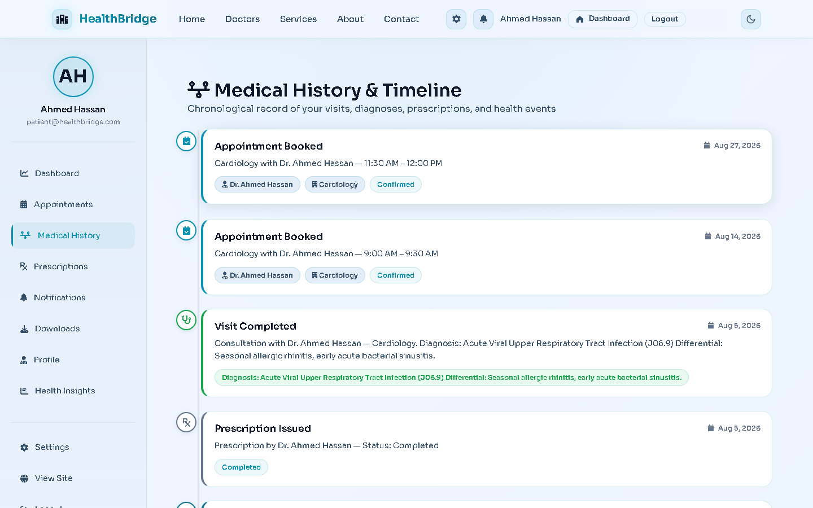
</div>

---

### 5. 🩺 Doctor Workspace & Clinical Encounters
Doctors have access to a real-time patient queue, schedule management, 1-click reschedule approvals/counter-suggestions, and an integrated clinical encounter studio for SOAP notes and digital prescriptions.

<div align="center">
  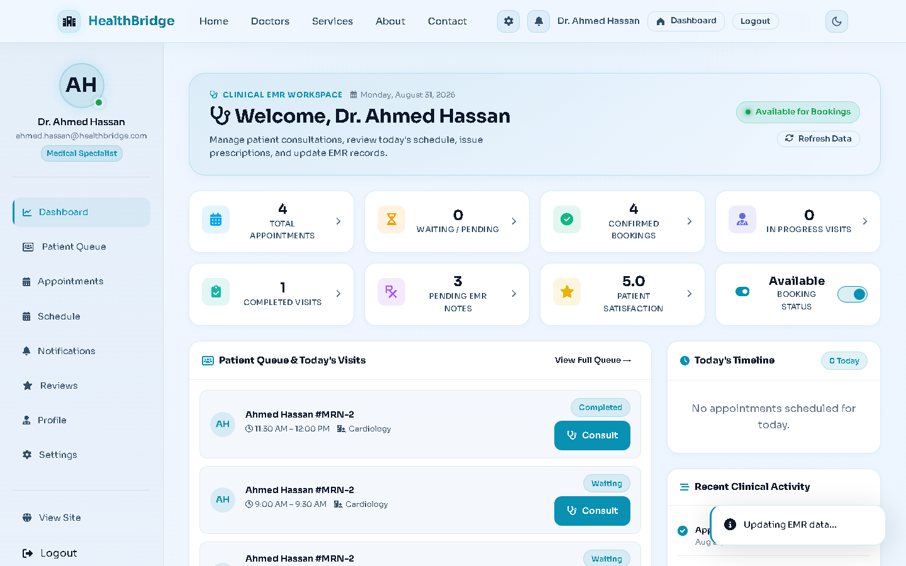
  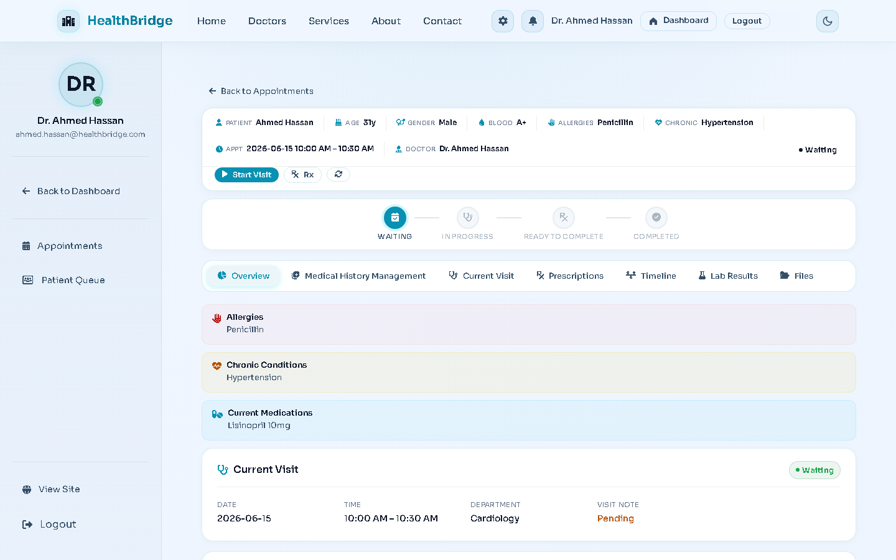
</div>

---

### 6. 🛡️ Administrative Control & Staff Directory
Hospital administrators monitor real-time hospital KPIs (patient traffic, revenue estimates, department load), manage medical staff accounts, and configure clinic departments.

<div align="center">
  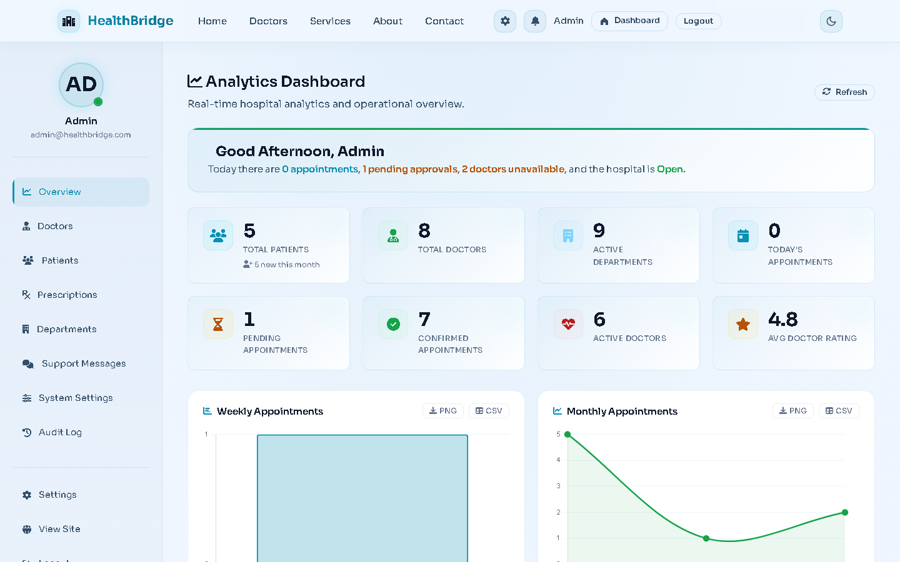
  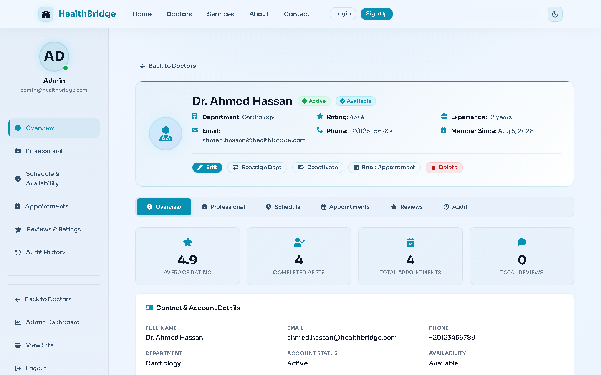
</div>

---

## 🌟 Key Features

### 👤 1. Patient Portal
* **Health Dashboard & Snapshot**: Real-time vital metrics, upcoming visits, active prescriptions, and recent clinical notes.
* **Interactive Booking Wizard**: 4-step smart appointment booking with real-time doctor availability checks and dynamic time-slot generation.
* **Reschedule Workflow**: Request appointment rescheduling with real-time slot validation, doctor negotiation, and instant approval/rejection handling.
* **Electronic Medical Records (EMR)**: Complete access to personal diagnosis history, visit summaries, lab reports, and doctor notes.
* **Prescription Manager**: Active/completed medication tracker with dosage schedules, instructions, and 1-click printable Rx summaries.
* **Notification Center**: Real-time alert feed with categorized badge counts and unread state management.
* **Settings & Preferences**: Personal profile management, notification settings, and security controls.

### 🩺 2. Doctor Workspace
* **Real-time Queue & Schedule**: Filter today''s appointments by status (`Confirmed`, `In-Progress`, `Completed`, `Reschedule Requested`).
* **Clinical Encounters & Notes**: Draft, review, and finalize visit notes with subjective, objective, assessment, and plan (SOAP) support.
* **Reschedule Negotiation**: 1-click **Approve**, **Reject**, or **Suggest Alternative Time** for patient reschedule requests.
* **Digital Prescription Studio**: Fast medication lookup, dosage specifications, frequency presets, and PDF/printable generation.
* **Doctor Availability Controls**: Weekly schedule manager, slot interval configuration, break-time definitions, and on-leave toggles.
* **Doctor Ratings & Reviews**: Public and internal rating analytics with patient feedback tracking.

### 🛡️ 3. Administrative Control Center
* **Hospital Analytics Dashboard**: Live metrics for patient volume, revenue estimation, department load, and appointment completion rates.
* **Staff & Doctor Directory**: Register, edit, activate/deactivate medical staff, and assign specialists to hospital departments.
* **Department Management**: Create, update, and manage specialty departments (Cardiology, Dermatology, Pediatrics, etc.).
* **Comprehensive Audit Trail**: Tamper-evident logging of authentication events, clinical edits, appointment shifts, and administrative actions.
* **Hospital Settings & Messaging**: Manage clinic metadata, working hours, contact info, and patient inquiry responses.

---

## 🏗️ System Architecture

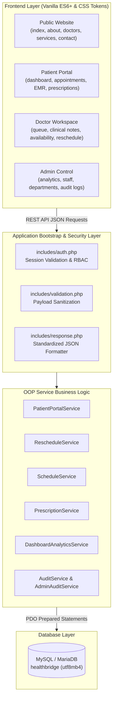

---

## 📁 Directory Structure

```text
healthbridge/
├── api/                             # RESTful JSON Endpoints
│   ├── admin/                       # Admin analytics & system operations
│   ├── appointments/                # Booking, slot picking, rescheduling API
│   ├── audit/                       # Audit logging endpoints
│   ├── auth/                        # Login, registration, password recovery
│   ├── departments/                 # Department CRUD & doctor assignments
│   ├── doctors/                     # Doctor profiles, schedules & ratings
│   ├── medical/                     # Clinical notes, EMR, visit drafts
│   ├── notifications/               # Notification feeds & status updates
│   ├── patient/                     # Patient dashboard aggregated data
│   ├── patients/                    # Patient directory management
│   ├── prescriptions/               # Prescription creation & print views
│   ├── schedule/                    # Doctor schedule configuration
│   └── settings/                    # Hospital profile & contact messages
│
├── assets/                          # Static Frontend Assets
│   ├── css/
│   │   ├── base/                    # Reset, typography, design tokens
│   │   ├── components/              # Buttons, cards, modals, tables, badges
│   │   ├── modules/                 # EMR, schedule, prescription styling
│   │   └── pages/                   # Page-specific stylesheets
│   └── js/
│       ├── components/              # Booking wizard, layout injector
│       ├── core/                    # Auth manager, global utilities, main.js
│       ├── modules/                 # Prescriptions, notifications, schedule
│       └── pages/                   # Page controllers (admin, doctor, patient)
│
├── database/                        # Database Schemas & Migrations
│   ├── healthbridge.sql             # Consolidated Master Schema + Demo Seed
│   ├── healthbridge_empty.sql       # Clean production schema + lookups
│   ├── healthbridge_demo_data.sql   # Standalone demo seed data
│   └── archive/                     # Historical migration scripts (Phases 6-10)
│
├── docs/
│   └── screenshots/                 # High-resolution application screenshots
│
├── includes/                        # Core Backend Framework Bootstrap
│   ├── auth.php                     # Session management & role-based auth
│   ├── db.php                       # PDO connection with .env & fallback
│   ├── helpers.php                  # Date formatting, sanitization helpers
│   ├── permissions.php              # Access control list (ACL) rules
│   ├── response.php                 # Unified JSON response helper
│   ├── validation.php               # Form & input validators
│   └── fragments/                   # Reusable HTML layout fragments (navbar, sidebar)
│
├── pages/                           # Role-Based Page Templates
│   ├── admin/                       # admin.html, admin-doctor-profile.html
│   ├── auth/                        # login.html, register.html, reset-password.html
│   ├── doctor/                      # doctor-dashboard.html, doctor-workspace.html
│   └── patient/                     # dashboard.html, appointments.html, prescriptions.html, etc.
│
├── services/                        # PHP OOP Service Classes (Business Logic)
├── tools/                           # CLI Test & Diagnostics Verification Scripts
├── .env.example                     # Environment configuration template
├── .gitignore                       # Git ignore rules (vendor, logs, env, caches)
├── composer.json                    # Composer dependencies (phpdotenv)
├── index.html                       # Public landing page
├── about.html                       # Hospital about page
├── contact.html                     # Contact and inquiry page
├── doctors.html                     # Public doctors directory
├── services.html                    # Public medical specialties list
└── README.md                        # Documentation
```

---

## 🚀 Installation & Setup Guide

### Prerequisites
- **Web Server**: Apache / Nginx / XAMPP / WampServer / LAMP stack
- **PHP**: Version 8.0 or higher with `pdo_mysql`, `mbstring`, `json`, and `session` extensions enabled
- **Database**: MySQL 8.0+ or MariaDB 10.4+
- **Composer**: (Optional) for managing PHP dependencies

---

### Step 1: Clone the Repository
Clone the project into your web server''s root directory (`htdocs` or `/var/www/html/`):

```bash
git clone https://github.com/youssefmohammed12/hospital-project.git healthbridge
```

---

### Step 2: Database Setup

1. Start **Apache** and **MySQL** in your server environment (e.g., XAMPP Control Panel).
2. Open **phpMyAdmin** (`http://localhost/phpmyadmin`) or connect via MySQL CLI:

```bash
mysql -u root -p < database/healthbridge.sql
```

> **Note**: `database/healthbridge.sql` creates the database `healthbridge`, builds all 25 indexed tables, constraints, foreign keys, and pre-populates demo accounts and lookup data.

---

### Step 3: Environment Configuration (Optional)

HealthBridge works out of the box with standard local development defaults (`127.0.0.1`, user `root`, empty password). For custom setups:

1. Copy the sample environment file:
   ```bash
   cp .env.example .env
   ```
2. Edit `.env` with your database credentials:
   ```ini
   DB_HOST=127.0.0.1
   DB_PORT=3306
   DB_NAME=healthbridge
   DB_USER=root
   DB_PASS=your_secure_password
   ```

---

### Step 4: Launch & Access

Open your web browser and navigate to:
```text
http://localhost/healthbridge/
```

---

## 🔑 Demo Accounts & Quick Login

The application provides demo accounts pre-configured for evaluation. You can also use the **Quick Login** buttons on the login screen to switch between roles instantly:

| Role | Email | Password | Access Area |
| :--- | :--- | :--- | :--- |
| **Administrator** | `admin@healthbridge.com` | `password` | `/pages/admin/admin.html` |
| **Doctor** | `dr.sarah@healthbridge.com` | `password` | `/pages/doctor/doctor-dashboard.html` |
| **Patient** | `ahmed.hassan@healthbridge.com` | `password` | `/pages/patient/dashboard.html` |

---

## 📡 API Endpoints Overview

HealthBridge uses a unified, RESTful JSON architecture. All requests return a standard JSON structure:
`{"success": true|false, "data": {...}, "message": "..."}`.

| Category | Endpoint | Method | Description |
| :--- | :--- | :--- | :--- |
| **Auth** | `/api/auth/login.php` | `POST` | Authenticate user & start session |
| **Auth** | `/api/auth/logout.php` | `POST` | Destroy session & logout |
| **Auth** | `/api/auth/current_user.php` | `GET` | Get authenticated user info |
| **Appointments** | `/api/appointments/get-available-slots.php` | `GET` | Calculate available doctor slots |
| **Appointments** | `/api/appointments/book.php` | `POST` | Book a new patient appointment |
| **Appointments** | `/api/appointments/request-reschedule.php` | `POST` | Patient requests new time slot |
| **Appointments** | `/api/appointments/approve-reschedule.php` | `POST` | Doctor confirms reschedule request |
| **Appointments** | `/api/appointments/suggest-reschedule.php` | `POST` | Doctor proposes alternate slot |
| **Medical** | `/api/medical/get-emr-data.php` | `GET` | Load full patient EMR record |
| **Medical** | `/api/medical/save-visit-draft.php` | `POST` | Auto-save clinical visit draft |
| **Prescriptions** | `/api/prescriptions/create.php` | `POST` | Issue prescription with medications |
| **Admin** | `/api/admin/dashboard-analytics.php` | `GET` | Fetch hospital KPIs & metrics |
| **Audit** | `/api/audit/get.php` | `GET` | Retrieve filtered system audit trail |

---

## 🧪 Developer CLI Verification & Tests

HealthBridge includes built-in diagnostic and health check scripts:

```bash
# Run Patient Portal service & endpoint diagnostics
php tools/test_dashboard_api.php

# Run end-to-end data integrity verification
php tools/verify_patient_portal.php
```

---

## 🔒 Security Architecture

- **Prepared Statements**: 100% of database interactions utilize PDO prepared statements with strict parameter binding to eliminate SQL injection risks.
- **Role-Based Access Control (RBAC)**: Enforced centrally via `includes/auth.php` and `includes/permissions.php`.
- **Input Sanitization**: Multi-layer input validation via `includes/validation.php`.
- **Session Protection**: Strict session cookies with `HttpOnly` and `SameSite` compliance.
- **Audit Logging**: Immutable tracking of critical state changes across clinical, administrative, and appointment events.

---

## 📄 License

This project is licensed under the **MIT License** — see the [LICENSE](LICENSE) file for details.

<div align="center">

Made with ❤️ for modern, accessible healthcare management.

</div>
